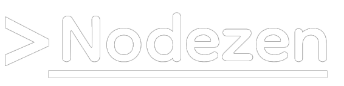

<p align="center" style="margin: 30px 0;">
  
</p>


# Comece a usar

Desenvolva de forma mais rápida e inteligente. Nodegen é uma CLI completa para o ecossistema Node.js que elimina o trabalho repetitivo de configuração inicial. Com suporte a arquiteturas REST e Modulares, essa ferramenta gera uma estrutura robusta e pronta para produção, permitindo que você comece a codificar imediatamente.

## ✨ Recursos
- **Múltiplas Estruturas**: Suporte para projetos REST (simples) e MODULAR (com Controllers, Services e Repositories).
- **Estilos de Código**: Geração de estruturas orientadas a objetos (OOP) ou funcionais, adaptadas à sua preferência.
- **Automação de Ferramentas**: Configuração automática de ESLint, Prettier e Dotenv para garantir um código limpo e organizado.
- **Controle de Versão**: Inicialização opcional de repositórios Git e criação de um arquivo .gitignore inteligente.

### Experiência do Usuário
- **Prompts Interativos**: Inicie o gerador com um guia passo a passo para configurar seu projeto.
- **Modo Flag-only**: Crie um projeto completo em uma única linha de comando.
- **Feedback Visual**: Carregadores de progresso e visualização da estrutura de pastas em tempo real.
- **Internacionalização (i18n)**: Suporte a varios idiomas através de uma flag.
- **Scripts e Finalização**: Geração de scripts para rodar o projeto e uma mensagem de finalização clara com os próximos passos.

## 📦 Instalação
Para começar a usar o Nodegen, instale-o globalmente via npm:

```bash
npm install -g nodegen
```

## 🚀 Uso

### Modo Interativo
Para um guia passo a passo, simplesmente execute o comando create sem nenhuma flag. O Nodegen fará as perguntas necessárias para configurar o seu projeto.

```bash
nodegen create
```

### Modo Flag
Se você prefere um fluxo de trabalho mais rápido, pode usar as flags para configurar o seu projeto em uma única linha.

**Exemplo de uso:**

```bash
nodegen create --name meu-app --structure modular --style oop --lang en --not-git
```

## 📝 Flags Disponíveis

O comando `create` suporta as seguintes flags:

| Flag | Descrição | Valores Possíveis | Padrão |
|------|-----------|-------------------|--------|
| -n, --name <name> | Define o nome da pasta e do projeto. | String | N/A |
| -t, --structure <type> | Escolhe o tipo de estrutura do projeto. | rest, modular | N/A |
| -s, --style <type> | Define o estilo de código para a estrutura. | oop, fp | N/A |
| --no-git | Impede a inicialização de um repositório Git. | N/A | N/A |
| --lang <lang> | Define o idioma da CLI para prompts e mensagens. | pt, en | pt |

## 📂 Estruturas Suportadas

### REST (Simples)
Uma estrutura leve, ideal para microsserviços e APIs com poucos endpoints.

```
meu-projeto/
├── src/
│   ├── app.js
│   ├── server.js
│   ├── controllers/
│   │   └── baseController.js
│   └── routes/
│       └── baseRoute.js
├── .env
├── .env.example
├── .prettierrc
├── .eslint.config.js
├── .gitignore
├── .cli-metadata.json
├── README.md
└── package.json

```

### MODULAR (Completa)
Uma estrutura robusta, ideal para APIs maiores com foco em escalabilidade e organização.

```
meu-projeto/
├── src/
│   ├── app.js
│   ├── server.js
│   ├── controllers/
│   │   └── baseController.js
│   ├── repositories/
│   │   └── baseRepositorie.js
│   ├── routes/
│   │   └── baseRoute.js
│   └── services/
│       └── baseService.js
├── .env
├── .env.example
├── .prettierrc
├── .eslint.config.js
├── .gitignore
├── .cli-metadata.json
├── README.md
└── package.json

```

## 🌐 Internacionalização
O Nodegen suporta os idiomas **Português (pt)** e **Inglês (en)**.  
Por padrão, a CLI usará `pt`, mas você pode alterá-lo com a flag `--lang`.

## 📜 Licença
Este projeto é licenciado sob a Licença MIT.

## 🤝 Contribuição
Contribuições, issues e sugestões são bem-vindas!  
Sinta-se à vontade para abrir um Pull Request.
